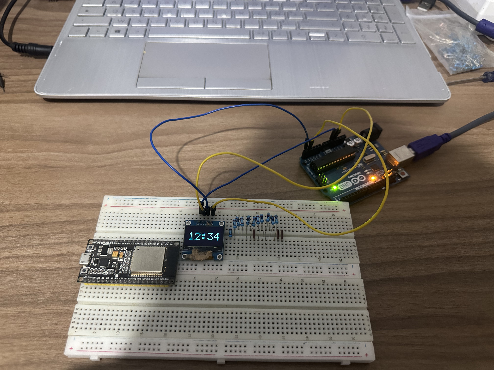

## AirClock
> A simple dot-style clock that displays weather data. Based on an ESP32.

---

### What is AirClock?
A simple and aesthetic clock designed to be modern and intuitive. It displays multiple time and weather information (such as current time, tempreture, humidity, etc.). It uses a simple dot-style font, that looks both aesthetic and modern. It has multiple menus and configurations.

### Why is AirClock useful?
It is designed to be a nice desk decoration. Both aesthetically pleasing and informational. It helps the user know information through a simple screen interface.

---

### How it works?
The ESP32 uses public APIs to pull data and display on screen, It uses a custom font renderer for the dot-style font. It features a very simple pcb design that houses and integrates all the components together. It also includes an internal battery and a USB-C port for charging.

#### In detail
The ESP32 first intializes the screen and WI-FI interface, then it connects and pulls information from public APIs (such as [TBD]). Then renders it through the font renderer which displays the information through the screen. If internet is provided it displays a No-Internet sign and waits for a connection (Could be configured through a web-interface). It updates the time every minute (Of course!) and the weather data every hour.

### Components
| **Component**    | **Usage**                                                              |
|------------------|------------------------------------------------------------------------|
| ESP32            | Obviously the main micro controller that basically controls everything |
| 2.4" TFT Display | The main display through which the user can see the information        |
| Battery          | The internal battery that can be used if the device is unplugged       |
| USB-C Port       | The port through which the battery can be charged and power the device |
| PCB Board        | This connects all the components to each other                         |
> Note: Bill of materials not yet added, replace by table above

### A 3D Model
[To be added]

### Schematic and board layout
[To be added]

### Final Product
[To be added]

---

### Current Progress
As of right now, all I did was develop a simple dot-style font render, and used it on a SSD1306 (monochrome dual-color OLED). And it actually works, it took a bit had a few issue with memory allocation and libary wasn't working but as you can see in the image below, it works.
